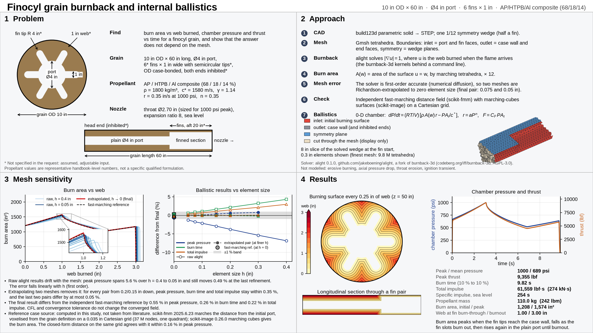

# alight

Solid-propellant grain burnback that runs from a command line and a Python script, with no GUI in the
loop. alight is a fork of [burnback-3d](https://codeberg.org/iff/burnback-3d) that adds:

- **`alight`**, a command-line front end to the burnback-3d solver. It needs no Qt and no display and
  builds on Linux, Windows and macOS with nothing but CMake and a C++17 compiler.
- **A Python pipeline** (`python/alight`): parametric grain → build123d CAD → Gmsh tetrahedra → `alight`
  → burn area against web → extrapolation to zero element size → chamber pressure and thrust, from a
  0-D model or a 1-D model with axial pressure drop and erosive burning.
- **Worked examples and a validation report**: closed-form grains, a published motor, a mesh
  sensitivity study, a video and a quad chart.

The burnback-3d GUI and everything else upstream are unchanged; the original README follows
[below](#burnback-3d).



## Why

The motivation is control by a language model. A GUI solver needs a person to click through mesh
import, boundary panels and export; an LLM agent cannot drive that reliably or check its own work.
Here every step is text in, text out:

- A grain is a handful of numbers in a Python dataclass (or its JSON form).
- Each stage is one command or one function call, and none of them prompts.
- Results are CSV and JSON, so an agent can read back what it produced, compare it with a closed
  form, and decide what to do next.
- The closed-form cases and the mesh sensitivity study are scripts in the repository, so "is this
  answer right?" is something the agent can run, not something it has to assert.

The finocyl example, its sensitivity study and the report in this repository were produced that way.

## Install

```shell
git clone --recursive https://github.com/jakeboening/alight
cd alight
cmake -S . -B build
cmake --build build --config Release
ctest --test-dir build -C Release          # solves a small cube and checks the answer
python -m pip install -e ".[full]"         # the Python pipeline; Python 3.10 or newer
python -m pytest tests                     # CAD, mesh, solver and burn area on small grains
```

The pipeline needs the `alight` executable. It looks, in order, at the `ALIGHT` environment variable,
the `PATH`, and `build/` in this checkout, and stops with instructions if it finds none. Prebuilt
binaries are attached to the [releases](https://github.com/jakeboening/alight/releases);
`cmake --install build` puts a local build on the `PATH`.

`[full]` adds scikit-fmm and scikit-image (independent reference solution) and imageio-ffmpeg (video).
The core needs only numpy, scipy, matplotlib, build123d and gmsh. Nothing is Linux-specific.

## Use

```python
from alight.geometry import FinocylGrain
from alight.solve import burn_table
from alight.ballistics import AP_HTPB_AL, PSI, simulate, size_throat

grain = FinocylGrain(case_diameter=10, port_diameter=4, length=60, n_fins=6,
                     fin_width=1, fin_tip_radius=4, fin_length=20, fin_start=40)   # inches
table = burn_table(grain, "work", sizes=(0.2, 0.1))        # two meshes, extrapolated
nozzle = size_throat(table, AP_HTPB_AL, 1000 * PSI)        # throat for a 1000 psi peak
result = simulate(table, AP_HTPB_AL, nozzle)
print(result.summary())
```

Grain types: `TubeGrain` (hollow cylinder; BATES with burning ends), `StarGrain`, `FinocylGrain`
(straight fins over part of the length) and `TaperedFinocylGrain` (bore and slots defined at axial
stations). Lengths are inches.

The solver on its own:

```shell
alight mesh.json out --tol 1e-4 --iters 20000
```

`mesh.json` is the burnback-3d mesh format (`python -m alight.mesh` writes it; so does
`tools/mesh_convert.py` from a Gmsh file). Three files are written:

- `out.u.f64`: burn time at every node, in mesh node order, as raw little-endian 64-bit floats. With
  the default recession speed of 1 this is the web burned when the flame reaches the node.
- `out.meta.json`: node and element counts, iterations, time step, residual, `converged`, `diverged`.
- `out.history.csv`: residual per iteration.

| Option | Default | Meaning |
| --- | --- | --- |
| `--cfl` | 1 | Pseudo-time step factor. The converged field does not depend on it. |
| `--iters` | 300 | Maximum number of iterations. |
| `--weight` | 1 | Diffusive weight. Values below about 0.75 diverge. |
| `--tol` | 0 | Stop when the largest nodal rate of change falls below this; 0 runs all iterations. |
| `--json` | | Also write the GUI's result file (mesh plus `burnbackResults`). |
| `--expect-max` | | Exit with an error unless the largest burn time is within 5 % of this value. |

Exit status: 0 on success, 3 if the iteration diverged, 4 if `--expect-max` failed.

## Accuracy

The burnback-3d scheme is first-order accurate: its burn time lags by an amount proportional to the
element size, which shifts the burn-area curve by a few percent on a practical mesh. The pipeline
therefore solves two meshes and extrapolates to zero element size. What that buys, from the examples:

| Check | Result |
| --- | --- |
| Closed-form tube, BATES and star grains, 15 geometries ([example 02](examples/02_analytic_validation)) | burn area within 0.27 % of the closed form over the first 95 % of the web (one BATES case 0.79 % next to its burnout discontinuity); RMS at most 0.20 % |
| Finocyl mesh sensitivity, 0.4 to 0.05 in elements ([example 01](examples/01_finocyl)) | raw peak pressure drifts 5.6 %; extrapolated pairs agree within 0.35 %, the last two within 0.05 % |
| Same finocyl against an independent fast-marching solution | 0.55 % in peak pressure, 0.26 % in burn time, 0.22 % in total impulse |
| NAWC motor no. 6 against a published 3-D burnback simulation ([example 03](examples/03_nawc_motor6)) | initial burn area within 2 %, pressure integral within 3 %, web at peak pressure within 4 %; pressure before the peak 14 % higher and the tail-off sooner (see the report) |
| NAWC motor no. 6 firing, 1-D model with Lenoir–Robillard erosive burning | head-end pressure within 3.7 % RMS of the measured trace over 0.3 to 2.8 s (23 % without erosion); nothing fitted, three transport properties assumed; tail-off about 0.5 s late |

The report, [`report/src/alight_whitepaper.pdf`](report/src/alight_whitepaper.pdf), has the method and
these results in full. Not modelled: throat erosion, dynamic burning, the ignition transient.

## Layout

- `cli/` the `alight` command line; `src/` the burnback-3d solver and GUI; `CMakeLists.txt` builds `alight`
- `python/alight/` the pipeline: `geometry`, `cad`, `mesh`, `solve`, `postprocess`, `ballistics`, `ballistics1d`,
  `fmm_check` (independent reference), `sensitivity`, `sections`, `video`, `quad_chart`
- `examples/` worked cases, see [`examples/README.md`](examples/README.md)
- `report/` the whitepaper; `references/` sources; `tests/` pipeline tests

## Changes to burnback-3d

- `cli/alight.cpp`, `CMakeLists.txt` and a test mesh (`cli/tests/cube.json`).
- `src/headers/globals.h` and `src/iosystem.cpp` compile without Qt when `ALIGHT_HEADLESS` is defined.
- `src/interface.cpp`: the GUI's time step used a variable that no longer exists (`maxHeight`); it now
  uses `minHeight`.

## License

GNU Affero General Public License v3 or later, like burnback-3d: see [`LICENSE`](LICENSE) for the
notice and [`COPYING`](COPYING) for the full text.

---

# Burnback-3d

Analysis of 3D burn surfaces for solid propellant rockets using tetrahedra based Time Marching Method as an alternative of the Level Set Method. Key features:

- Combustion time computation with tetrahedra meshes for solid propellant rockets
- Supports per node configuration of the recession speed
- Supports isotropic and anisotropic propellants
- Graphical interface to evaluate the results
- Import and export data of any mesh formats with a python script

If you only need a 2D analysis, see [burnback-qt](https://codeberg.org/iff/burnback-qt).

Built binaries for Windows and MacOS can be found at [releases](https://github.com/iffse/burnback-3d/releases). For Linux is advisable to compile from source as Qt has no compatibility across different distributions (binaries built with Ubuntu CI didn't work on my Arch Linux). It is also possible to run the Windows binary through Wine, with minor flickers.

Supports both light and dark theme. Should use accordingly to your system theme. If you want dark theme, and it isn't, add `QT_QUICK_CONTROLS_MATERIAL_THEME=Dark` to your environment variables.


The contour visualization is only for preview purposes. For a much more detailed visualization, try [ParaView](https://www.paraview.org/):


## Usage

First, you will need a mesh in order to use the program for analysis. For instance, [Gmsh](https://gmsh.info/) is an open source meshing software that can generate 2D and 3D finite element mesh.

Once you have the mesh, you will have to convert it into a Json file with tetrahedra based information. A python script that converts Gmsh mesh file to this format using [meshio](https://github.com/nschloe/meshio) can be found at tools directory: [mesh_convert.py](./tools/mesh_convert.py). The script is optimized for speed and can convert a mesh with 200K nodes in seconds. If you are using another meshing tool, feel free to edit it (probable you will only need to change the cell names).

When using Gmsh and the script, you can define boundary conditions with physical groups with the following naming conventions in surfaces:

- `inlet`: The boundary is an inlet, where the propellant starts to burn. You can later give it a value as the boundary in boundary panels, if you want a boundary starts to be already burnt for the given time.
- `outlet`: Used for boundaries where the combustion ends, like the shell of the container.
- `symmetry`: Used to indicate that a boundary defines a symmetry. The condition will automatically find the normal vector pointing outwards of the mesh if the boundary triangles are provided in a standard way (such as the output given by Gmsh). In other case, the vector is reversed and you should manually change its sign in the boundary conditions panel.
- `condition`: Placeholder for conditions that should be changed later in Burnback GUI (will be treated as outlet by default).

In volumes, you can define recession velocities:

- `recession 1 [0.5 0.2 45 30 25]` (optional): Used to indicate the recession velocity of a node, defaults to 1. When more than 1 number is specified, the velocity is considered to be anisotropic: First 3 numbers are the recession speed to the `x`, `y`, and `z` axis respectively, and the last 3 numbers are the rotation angles in degree with respect to axis `x`, `y`, and `z` respectively.

Everything after the names above will be added to a description field.

Example files of Gmsh can be found at [examples/gmsh](./examples/gmsh). The commands to be executed to obtain the Json file are:
```shell
gmsh -3 mesh.geo
python mesh_convert.py mesh.msh
```

If you want to use the exported results to another format other than Json (for instance `.CGNS`, or `.dat` for TecPlot/ParaView, etc.) you can use the [result_convert.py](./tools/result_convert.py) script. Usage is:
```shell
python result_convert.py result.json output.extension
```
You can provide only the extension name for the output file. In this case the name is inferred from the input file.

## Compiling

Can be compiled by either using command line or using the QtCreator. Binaries should be found at `<Project Dir>/target/debug|release`. When building with QtCreator, `<Project Dir>` equals to where the build location is set.

Qt modules dependencies:

- qt-3d
- qt-charts
- qt-declaratives
- qt-quickcontrols2

WARNING: Do not compile with Qt 5.15.2. The 3D model importer is broken for that version.

### Using command line

The project can be easily built with the `Makefile`. The `Makefile` is written with multiplatform compilation in mind, it should work with Linux, macOS, or Microsoft Windows:

- `make run`: Build the debug binary and run
	- `make run-sanitizer`: Build the debug binary with sanitizer and run
- `make debug`: Build the debug binary
- `make release`: Build the release binary

### Using QtCreator

Open `burnback-3d.pro` with QtCreator, set your compiling options if needed, and runs directly by clicking the play button at bottom-left.

